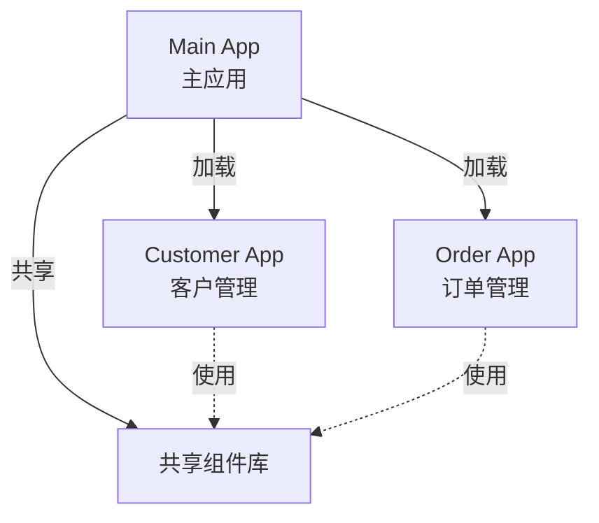

# erp-web - 架构设计

> **最后更新**: 2025-12-01

## 📊 项目概述

erp-web 是基于 React 18 + 微前端架构的企业级 ERP 前端应用，采用 Monorepo 管理多个子应用，支持模块化开发和独立部署。

---

## 🏗️ 技术架构

### 整体架构

```
┌───────────────────────────────────────────────────────┐
│                    erp-web (Monorepo)                  │
├───────────────────────────────────────────────────────┤
│  packages/                                             │
│  ├── main/           ← 主应用 (核心团队维护)            │
│  ├── customer/       ← 客户管理子应用 (待创建)          │
│  └── order/          ← 订单管理子应用 (待创建)          │
└───────────────────────────────────────────────────────┘
```

### 微前端架构 (Wujie)



---

## 💻 技术栈

| 类别 | 技术 | 版本 | 用途 |
|------|------|------|------|
| **核心** | React | 18.2+ | UI 框架 |
| | TypeScript | 5.2+ | 类型系统 |
| | Vite | 5.0+ | 构建工具 |
| **路由** | React Router | 6.20+ | 路由管理 |
| **状态** | Zustand | 4.4+ | 状态管理 |
| **UI** | Ant Design | 5.12+ | 组件库 |
| | Less | 4.2+ | CSS 预处理 |
| **工具** | Axios | 1.6+ | HTTP 客户端 |
| | Day.js | 1.11+ | 日期处理 |
| **微前端** | Wujie | - | 微前端框架 |

---

## 📁 项目结构

```
erp-web/
├── packages/
│   └── main/                    # 主应用
│       ├── src/
│       │   ├── App.tsx          # 根组件
│       │   ├── main.tsx         # 入口文件
│       │   ├── router/          # 路由配置
│       │   │   └── index.tsx
│       │   ├── features/        # 功能模块
│       │   │   ├── auth/
│       │   │   ├── dashboard/
│       │   │   ├── customer/
│       │   │   ├── order/
│       │   │   └── ...
│       │   ├── components/      # 通用组件
│       │   │   ├── Layout/
│       │   │   ├── ListPage.tsx
│       │   │   └── AuthGuard.tsx
│       │   ├── api/             # API 接口
│       │   │   ├── request.ts
│       │   │   ├── auth.ts
│       │   │   └── ...
│       │   ├── store/           # 全局状态
│       │   │   └── user.ts
│       │   ├── utils/           # 工具函数
│       │   ├── styles/          # 全局样式
│       │   │   ├── theme.less
│       │   │   └── global.less
│       │   └── types/           # 类型定义
│       ├── public/              # 静态资源
│       ├── package.json
│       ├── vite.config.ts       # Vite 配置
│       └── tsconfig.json
├── pnpm-workspace.yaml          # Monorepo 配置
├── package.json                 # 根项目配置
├── Dockerfile
├── nginx.conf                   # Nginx 配置
└── docker-compose.prod.yml
```

---

## 🎯 核心设计

### 1. 路由设计

```typescript
// router/index.tsx
const routes = [
  {
    path: '/',
    element: <Layout />,
    children: [
      { path: '', element: <Dashboard /> },
      { path: 'customers', element: <CustomerList /> },
      { path: 'orders', element: <OrderList /> },
      { path: 'projects', element: <ProjectList /> },
      // ...
    ],
  },
  {
    path: '/login',
    element: <Login />,
  },
];

export default function Router() {
  return useRoutes(routes);
}
```

### 2. 状态管理 (Zustand)

```typescript
// store/user.ts
import { create } from 'zustand';

interface UserState {
  user: User | null;
  token: string | null;
  setUser: (user: User) => void;
  setToken: (token: string) => void;
  logout: () => void;
}

export const useUserStore = create<UserState>((set) => ({
  user: null,
  token: localStorage.getItem('token'),
  setUser: (user) => set({ user }),
  setToken: (token) => {
    localStorage.setItem('token', token);
    set({ token });
  },
  logout: () => {
    localStorage.removeItem('token');
    set({ user: null, token: null });
  },
}));
```

### 3. API 请求封装

```typescript
// api/request.ts
import axios from 'axios';
import { useUserStore } from '@/store/user';

const request = axios.create({
  baseURL: '/api',
  timeout: 10000,
});

// 请求拦截器 - 添加 Token
request.interceptors.request.use((config) => {
  const token = useUserStore.getState().token;
  if (token) {
    config.headers.Authorization = `Bearer ${token}`;
  }
  return config;
});

// 响应拦截器 - 统一错误处理
request.interceptors.response.use(
  (response) => response.data,
  (error) => {
    if (error.response?.status === 401) {
      useUserStore.getState().logout();
      window.location.href = '/login';
    }
    return Promise.reject(error);
  },
);

export default request;
```

### 4. 组件设计原则

**组件分类**:
- **Page Components** - 页面级组件 (`features/*/`)
- **Layout Components** - 布局组件 (`components/Layout/`)
- **Common Components** - 通用组件 (`components/`)

**设计原则**:
```typescript
// ✅ 函数组件 + TypeScript
interface Props {
  title: string;
  onSubmit: (data: FormData) => void;
}

export default function MyComponent({ title, onSubmit }: Props) {
  const [value, setValue] = useState('');
  
  return (
    <div>
      <h1>{title}</h1>
      { /* ... */ }
    </div>
  );
}
```

### 5. 样式方案

**Less + CSS Modules**:

```less
// MyComponent.module.less
@import '@/styles/variables.less';

.container {
  padding: @spacing-md;
  
  .title {
    font-size: @font-size-lg;
    color: @primary-color;
  }
}
```

```typescript
// MyComponent.tsx
import styles from './MyComponent.module.less';

export default function MyComponent() {
  return (
    <div className={styles.container}>
      <h1 className={styles.title}>Title</h1>
    </div>
  );
}
```

---

## 🚀 核心功能模块

### 认证模块 (Auth)

**功能**:
- 登录 / 登出
- Token 管理
- 路由守卫

```typescript
// components/AuthGuard.tsx
export default function AuthGuard({ children }: PropsWithChildren) {
  const token = useUserStore((state) => state.token);
  const location = useLocation();
  
  if (!token) {
    return <Navigate to="/login" state={{ from: location }} replace />;
  }
  
  return <>{children}</>;
}
```

### 布局模块 (Layout)

**组件结构**:
```
Layout
├── Header (顶部导航)
├── Sidebar (侧边菜单)
└── Content (内容区域)
```

### 列表页面通用组件

```typescript
// components/ListPage.tsx
interface ListPageProps<T> {
  columns: ColumnsType<T>;
  fetchData: (params: any) => Promise<{ data: T[]; total: number }>;
  createForm?: ReactNode;
  editForm?: ReactNode;
}

export default function ListPage<T>({ columns, fetchData }: ListPageProps<T>) {
  // 统一的列表页逻辑：
  // - 数据加载
  // - 分页
  // - 搜索
  // - 新增/编辑/删除
}
```

---

## 📦 构建优化

### Vite 配置

```typescript
// vite.config.ts
export default defineConfig({
  plugins: [react()],
  
  resolve: {
    alias: {
      '@': '/src',
    },
  },
  
  css: {
    preprocessorOptions: {
      less: {
        javascriptEnabled: true,
        modifyVars: {
          '@primary-color': '#1890ff',
        },
      },
    },
  },
  
  build: {
    rollupOptions: {
      output: {
        manualChunks: {
          'vendor-react': ['react', 'react-dom', 'react-router-dom'],
          'vendor-antd': ['antd', '@ant-design/icons'],
        },
      },
    },
  },
});
```

### 代码分割

```typescript
// 路由懒加载
const CustomerList = lazy(() => import('@/features/customer/List'));

<Suspense fallback={<Spin />}>
  <Routes>
    <Route path="/customers" element={<CustomerList />} />
  </Routes>
</Suspense>
```

---

## 🎨 UI 设计规范

### 主题变量

```less
// styles/variables.less
@primary-color: #1890ff;
@link-color: #1890ff;
@success-color: #52c41a;
@warning-color: #faad14;
@error-color: #f5222d;

@font-size-base: 14px;
@font-size-lg: 16px;
@font-size-sm: 12px;

@spacing-xs: 4px;
@spacing-sm: 8px;
@spacing-md: 16px;
@spacing-lg: 24px;
```

### 组件规范

- 按钮: Primary / Default / Dashed / Text
- 表单: 24栅格布局，label 宽度 120px
- 表格: 斑马纹，可排序，分页
- 弹窗: 宽度 600px，居中显示

---

## 🔗 API 集成

### API 模块化

```typescript
// api/customer.ts
import request from './request';

export interface Customer {
  id: number;
  name: string;
  phone: string;
  status: string;
}

export const customerApi = {
  getList: (params?: any) => 
    request.get<{ data: Customer[]; total: number }>('/customers', { params }),
    
  getDetail: (id: number) => 
    request.get<Customer>(`/customers/${id}`),
    
  create: (data: Partial<Customer>) => 
    request.post<Customer>('/customers', data),
    
  update: (id: number, data: Partial<Customer>) => 
    request.put<Customer>(`/customers/${id}`, data),
    
  delete: (id: number) => 
    request.delete(`/customers/${id}`),
};
```

---

## 📱 响应式设计

### 断点

```less
// styles/variables.less
@screen-xs: 480px;
@screen-sm: 576px;
@screen-md: 768px;
@screen-lg: 992px;
@screen-xl: 1200px;
@screen-xxl: 1600px;
```

### 媒体查询

```less
.container {
  padding: @spacing-lg;
  
  @media (max-width: @screen-md) {
    padding: @spacing-sm;
  }
}
```

---

## 📚 相关文档

- [部署架构](./部署架构.md)
- [优化建议](./优化建议.md)
- [技术栈详解](../TECH_STACK.md)
- [功能模块清单](../ERP_FEATURES.md)

---

**前端架构: 组件化、模块化、工程化** 🎨
